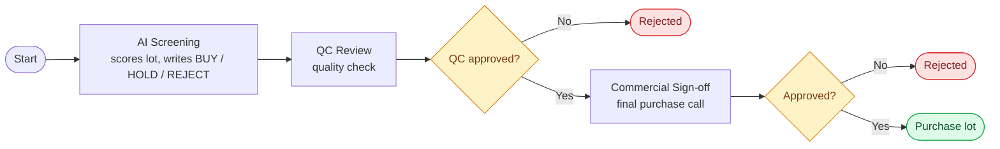

# Green Lot Cupping & Approval

A Joget DX 9 app that replaces the spreadsheet + email process a specialty coffee roastery
uses to score green (unroasted) coffee lots and decide whether to buy them.

---

## What the app does

Green coffee lots are sourced from producers/cooperatives. Each lot is **cupped**
(SCA-scored, 0–100) by one or more cuppers before the roastery commits to buy. This app runs
that whole flow:

**Log a lot → cup it → AI pre-screens it → QC approves → Commercial signs off → buy.**

### The data model (designed for this case)
- **Coffee Lot** — producer, country, region, variety, process, altitude, harvest year, green
  kg, price/kg, **plus** system-maintained screening fields (status, average score, cupper
  spread, session count, AI decision, AI rationale) and an **Approvals** section (QC decision +
  comments, Commercial decision + comments).
- **Cupping Session** — one cupper's SCA sheet: the 10 attributes (fragrance/aroma, flavor,
  aftertaste, acidity, body, balance, uniformity, clean cup, sweetness, overall), a defect
  deduction, and an **auto-calculated total /100**. Linked to a lot (one lot → many sessions).

### How it works, stage by stage
1. **Log the lot** — a buyer records origin, producer, process, price and volume.
2. **Cup it** — each cupper files an SCA score sheet; the total auto-calculates.
3. **AI screening** — the **Lot Screening Agent** reads all the cupping sheets for a lot,
   computes the average score and the **cupper spread** (max − min, a disagreement signal),
   scans notes for defects, then recommends **BUY / HOLD / REJECT** with a written rationale —
   and writes all of that back onto the lot record.
4. **QC Review** — Quality Control approves or rejects on quality grounds.
5. **Commercial Sign-off** — Commercial makes the final purchasing decision.

### The AI agent (the centrepiece — genuinely *agentic*)
Given a lot, the agent on its own:
- **Tool call 1** — SQL: pull every cupping sheet for that lot.
- **Tool call 2** — SQL: pull the other lots (price/score benchmarking).
- **Reasons** — computes average, spread, session count; reads defect notes.
- **Decision branch** — REJECT if avg < 80; HOLD if avg ≥ 80 but spread > 4 or a defect;
  BUY if avg ≥ 80, tight spread, no defect.
- **Tool call 3** — SQL `UPDATE`: writes decision, rationale, avg, spread, status back to the DB.

Runs on a **free OpenRouter model** (`nvidia/nemotron-3-super-120b-a12b:free`). Verified for
all three outcomes: **ETH → BUY (86.83)**, **COL → HOLD (83.75)**, **BRA → REJECT (74.50)**.

### The dashboard
The **Home / Welcome** page: a branded hero with a personalized greeting, a 4-step workflow
guide, and **two live, data-driven charts** (Apache ECharts) — lots by AI recommendation
(donut) and average cupping score by lot (bar). Both run off SQL, so they auto-update.

---

## The two-level approval workflow

The two gateways are the two levels — **Quality Control** first, then **Commercial**. Each is an
exclusive decision: a lot is purchased only if it clears both gates, and a rejection at either
gate ends the flow. In the app this is driven by the lot's status plus the QC and Commercial
decision fields, reviewed on the **QC Review** and **Commercial Sign-off** screens.

---

## How to open it

**URL:** `https://aayuhun13.on.joget.cloud` · **User:** `admin` · **Password:** `admin`
Then open the **Green Lot Cupping & Approval** app.

---

## Screens

> The screenshots referenced below live in an `images/` folder next to this README.

### Welcome dashboard

- Opens on a greeting banner that shows whoever is logged in, with shortcut buttons straight to the main screens.
- The "workflow" strip below it lays out the four stages, so anyone new picks up the process at a glance.
- Two charts read directly from the database: the average cupping score for each lot, and how the lots split across Buy / Hold / Reject. They refresh on their own as lots change.

### Coffee Lots

- The master list of every green coffee lot in the system.
- Each row shows the lot reference, the country, its average cupping score, and the recommendation the AI gave it.
- Use **New** to add a lot, or **Edit** to open the full record.

- Inside a lot you get the origin details first, then the **AI Screening Outcome** section: the average score, how far apart the cuppers were, the decision, and the rationale the agent wrote.
- Under that are the two approval sections that QC and Commercial fill in.

### Cupping Sessions

- Every row here is one cupper's SCA score sheet for a lot.
- To add one, pick the lot, type in the cupper name and the ten SCA scores; the total out of 100 fills in by itself.
- More than one person can score the same lot, and the AI later averages them and checks how much they disagreed.

### QC Review

- The first of the two approvals, handled by Quality Control.
- Open a lot, read the AI's screening, then set the QC decision and leave a comment.

### Commercial Sign-off

- The final gate. Commercial opens the same lot, sees where QC landed, and makes the buying call with a comment.
- A lot only clears for purchase once both QC and Commercial have approved it.

---

## Click-by-click — using the app

**See a lot's AI screening + approvals**
1. Left menu → **Coffee Lots**.
2. Click **Edit** on a lot (e.g. *BRA-2026-031*).
3. Scroll to **AI Screening Outcome** — the score, spread, decision and the agent's rationale.
4. Scroll to **Approvals** — QC and Commercial decisions.

**Add a cupping sheet**
1. Left menu → **Cupping Sessions** → **＋ New**.
2. Pick the **Coffee Lot**, enter the cupper and the 10 SCA scores → the **Total** auto-fills.
3. **Submit**.

**Two-level approval**
1. **QC Review** → open a lot → set **QC Quality Decision** (Approve/Reject) + comments → save.
2. **Commercial Sign-off** → open the same lot → set **Commercial Sign-off** + comments → save.

---

## Click-by-click — running the AI agent (for the screen recording)

> ⚠️ Currently blocked by a Joget platform bug — see "Known issue" below. These are the steps
> for once it's cleared (or on a patched instance).

1. Design console → app **Green Lot Cupping & Approval** → **AI Agent Builder → Lot Screening
   Agent → Preview**.
2. In **Lot record id to screen**, paste one of:
   - **BRA / REJECT** (best live demo): `fdeb9ce9-c657-4307-a1c6-68611d221055`
   - **COL / HOLD**: `7e4e9d50-b5d7-4fb6-9cce-4f1313aa3f98`
   - **ETH / BUY**: `13291dc7-eaad-44d2-9b9a-35ca545d141f`
3. Click **Run Agent**. Watch **Execution Output**: the agent makes its **Database Query** tool
   calls, reasons, then prints the decision + rationale (~20–30s on the free model).
4. Open the running app → **Coffee Lots** → show the **Average Cupping Score** and **AI
   Recommendation** columns the agent just wrote — proof the write-back landed.

**Fallback recording (works even while the bug is live):** walk the agent's **Design** (SQL
tool + decision rubric) → show the **Coffee Lots** list (BUY/HOLD/REJECT) → open a lot to show
the persisted **AI Rationale** → state that the live re-run is blocked by a current Joget
platform bug. That still demonstrates the full agentic pipeline.

---

## Known issue (platform, not the app)

Live agent runs currently fail with
`Failed making field 'org.joget.ai.agent.model.AgentTaskMetadata#useMemory' accessible …` —
a bug in Joget's own **`agent-builder-plugin-8.2.2`** (its JSON deserializer can't read that
field). It reproduces on a brand-new, trivial agent, so it's a platform-side issue, not something in the app's setup.
**Fix:** update the AI Agent Builder plugin via **System Settings → Manage Plugins** to a
version newer than 8.2.2, or wait for the hosted instance to be patched. Full detail in
`BUILD_LOG.md` (challenge #6).

---

## Files in this submission
- `README.md` — this file.
- `CHECKLIST.md` — every assessment requirement mapped to status.
- `BUILD_LOG.md` — the honest build log (what worked, what didn't, routes dropped).
- `green_lot_cupping.jwa` — the exported application, ready to import into any Joget DX 9 instance.
- *(your)* screen recording of the agent.
